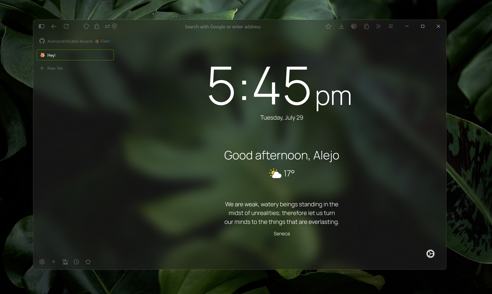

# Latin Accent 🦊

Latin Accent is a custom Firefox theme for Windows that leverages your system's accent color to create translucent UI surfaces for a sleek, modern aesthetic. It embodies the concept of an "accent" as both a personalized visual tone and a vibrant, expressive characteristic.

**Normal Tabs**


**Vertical tabs**


**CSS animations**
|  |  |
|:--:|:--:|

**Works with your accent**
<table style="width:100%;">
  <tr>
    <td style="width:20%; text-align:center;"></td>
    <td style="width:20%; text-align:center;"></td>
    <td style="width:20%; text-align:center;"></td>
    <td style="width:20%; text-align:center;"></td>
    <td style="width:20%; text-align:center;"></td>
  </tr>
</table>

### 🛠 Installation
1. Open `about:profiles` in Firefox.
2. Locate the **Root Directory** of your active profile and open it.
3. Copy the `chrome` folder (from this repo) into that directory.  
   It must contain:
   - `userChrome.css`
   - `userContent.css`

### ⚙️ Enable Custom CSS in Firefox
Go to `about:config` and set the following preference to **true**:

```
toolkit.legacyUserProfileCustomizations.stylesheets
```

This allows Firefox to load your custom `userChrome.css` and `userContent.css`.

### 🚩 Necessary flags
In `about:config`, set the following preferences to **true**:

```
layout.css.backdrop-filter.enabled
widget.windows.mica
gfx.webrender.all
browser.tabs.allow_transparent_browser
```

### 🪟 Transparency - Option 1
In `about:config`, set to **2**
```
widget.windows.mica.toplevel-backdrop
```

### 🪟 Transparency - Option 2
Use [**Mica For Everyone**](https://github.com/MicaForEveryone/MicaForEveryone)


### 🪟 Transparency - Option 3
Use [**Translucent Windows (Windhawk mod)**](https://windhawk.net/mods/translucent-windows)


### 🧪 Optional – Custom New Tab Page with Bonjour
To match the full vibe, install the [**Bonjour**](https://addons.mozilla.org/en-US/firefox/addon/bonjour-startpage/) extension and apply the custom config.

### Steps:
1. Install the **Bonjour** extension from Mozilla Add-ons.
2. Open Bonjour's settings → click **"Show all settings"**.
3. Copy the content of `bonjour.css`.
4. Paste it on Custom Style section. 
5. Your new tab page will now match the Latin Accent aesthetic.

### 💬 Notes
- Restart Firefox after installing or editing any styles.
- Some effects depend on OS-level features (e.g. Mica on Windows 11)
- Transparency effects may vary depending on your system theme and hardware acceleration settings.

## 🧉 Made with cariño by [@Acercandr0](https://github.com/Acercandr0)
Enjoy it. Fork it. Remix it. Make it yours.
